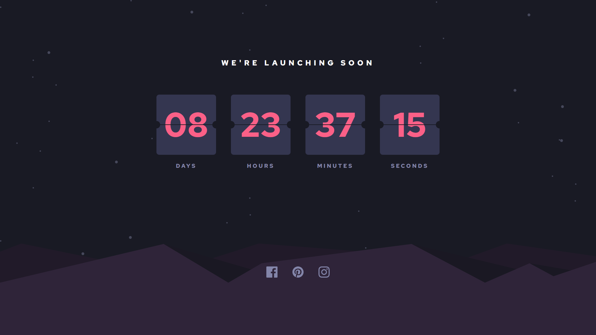

# Frontend Mentor - Launch countdown timer solution

This is a solution to the [Launch countdown timer challenge on Frontend Mentor](https://www.frontendmentor.io/challenges/launch-countdown-timer-N0XkGfyz-). Frontend Mentor challenges help you improve your coding skills by building realistic projects. 

## Table of contents

- [Overview](#overview)
  - [The challenge](#the-challenge)
  - [Screenshot](#screenshot)
  - [Links](#links)
- [My process](#my-process)
  - [Built with](#built-with)
  - [What I learned](#what-i-learned)
  - [Continued development](#continued-development)
  - [Useful resources](#useful-resources)
- [Author](#author)
- [Acknowledgments](#acknowledgments)

## Overview

### The challenge

Users should be able to:

- See hover states for all interactive elements on the page
- See a live countdown timer that ticks down every second (start the count at 14 days)
- **Bonus**: When a number changes, make the card flip from the middle

### Screenshot

### Links

- Solution URL: [GitHub](https://github.com/Kelechikizito/launch-countdown-timer)
- Live Site URL: [Vercel](https://launch-countdown-timer-1bawvi9cp-kelechi-kizito-ugwus-projects.vercel.app/)

## My process

### Built with

- Semantic HTML5 markup
- Flexbox
- CSS Grid
- Mobile-first workflow
- [React](https://reactjs.org/) - JS library
- [TailwindCSS](https://tailwindcss.com/) - CSS framework

### What I learned

I Implemented what I learnt of Components and React Hooks.

### Continued development

I look to improve on my React skills.

### Useful resources

## Author

- Website - [GitHub](https://github.com/kelechikizito)
- Frontend Mentor - [kelechikizito](https://www.frontendmentor.io/profile/Kelechikizito)
- Twitter - [@kelechiikizito](https://www.x.com/kelechiikizito)

## Acknowledgments
